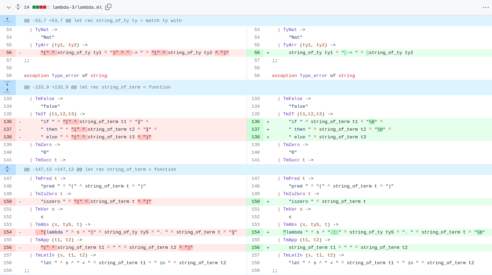

# PRACTICA DLP
#### Mateo Amado Ares, Iván García Quintela


### Tecnichal Manual
1. Improvements on the declaration of lambda functions:

    1. Recognition of multi-line exppressions:
        - We modified the following files:
            * main.ml
                ```
                let ends_with_semicolon str =
                    let len = String.length str in
                    if len < 2 then
                        false
                    else
                        let last_2_char = String.sub str (len - 2) 2 in
                        last_2_char = ";;";;

                let rec process_line line = 
                    if ends_with_semicolon line 
                        then s token (from_string line)
                else
                    begin
                    print_string "  ";
                    flush stdout;
                    process_line(line ^ " " ^ read_line())
                    end
                ;;

                let rec execute = function
                | [] ->
                    ()
                | Eval (term)::tail ->
                    print_endline (string_of_term (eval term) ^ " : " ^ string_of_ty (typeof emptyctx term));
                    execute tail
                ;;
                ```
                We then call process line from the top_level_loop() function.

            * lexer.ml, lambda.mli, parser.mli, parser.mly
                
                Added support for the SEMICOLON token.
                ```
                | ";;" { SEMICOLON }
                
                %token SEMICOLON
                ```
            * Examples
            
                We can now run an expression on many lines:

                    true
                    ;;

                    if false 
                    then true 
                    else false;;

    2. "pretty-printer" :
        - We modified the following files:
            * lambda.ml
            
                Se eliminaron los paréntesis redundantes


            * main.ml
                
2. Extensions of the lambda-calculus language:

    1. Internal fixed point combiner

    2. Global definition context
        * Using a Hashtbl module, with functional behaviour.
        * main.ml 

                    | Bind (name, term)::tail -> 
                        print_endline (name ^ " : " ^ string_of_ty (typeof emptyctx term));
                        execute tail
        * parser.mly

                open Hashtbl;;

                let table = create 1024;;

                #under command term:
                    | IDV EQ term { add table $1 $3; Bind ($1, $3) }
                #on atomic term
                    //{ TmVar $1 }
                    { try find table $1 with Not_found -> TmVar ($1) }     
        * lambda.ml y lambda.mly add to command:

                | Bind of string * term      


    3. String type, concat and strlen implementation


        lambda.mli and lambda.ml
            
            type ty
                | TyString
            
            type term
                | TmString of string
                | TmConcat of term * term
                | TmStrlen of term

        lexer.mll
                | "strlen"    { CONCAT }
                | "concat"    { CONCAT }
                | "String"    { STRING }

                  | '"'[^ '"' ';' '\n']*'"' {let s = Lexing.lexeme lexbuf in STRINGV (String.sub s l (String.length s - 2)) }

        parser.mly
                
                añadir %token CONCAT, %token STRLEN, %token STRING, %token <string> STRINGV

        lambda.ml
              
              | TmConcat (TmString s1, TmString s2) ->
                    TmString (s1 ^ s2)

              | TmConcat (TmString s1, TmString t2) ->
                    let t2' = eval1 t2 in
                    TmConcat (TmString s1, t2')
  
              | TmConcat (TmString t1, TmString s2) ->
                    let t1' = eval1 t1 in
                    TmConcat (TmString t1, s2')
      
              | TmStrlen (TmString s) ->
                let len = String.length s in
                let rec make_succ n acc = 
                    if n = 0 then acc else make_succ (n - 1) (TmSucc acc) in make_succ len TmZero
              | TmStrlen (s) ->
                let s' = eval1 s in
                TmStrlen (s')
    
    4. Tuples and Projections

        lambda.ml
        
            ty:         | TyTuple of ty list

            term:       | TmTuple of term list
                        | TmProj of term * int

            string_of_ty:  | TyTuple tyL ->
                            let sFdL = List.map string_of_ty tyL in
                             "(" ^ (String.concat ", " sFdL) ^ ")"

            typeof:     | TmTuple t -> TyTuple (List.map (typeof ctx) t)

                        | TmProj (t, n) ->
                         let tyT = typeof ctx t in
                        (match tyT with
                        | TyTuple tyL ->
                            (match List.nth_opt tyL n with
                           | Some ty -> ty 
                            | None -> raise (Type_error "Projection position out of bounds"))
                            | _ ->
          raise (Type_error "Cant apply projection to non-tuple type"))
            string_of_term:     | TmTuple t -> 
                                let values_string = String.concat ", " (List.map string_of_term t) in
                                "tuple(" ^ values_string ^ ")"
    
                                | TmProj (t,pos) ->
                                "proj(" ^ string_of_term t ^ ", " ^ string_of_int pos ^ ")"

            free_vars:      | TmTuple t -> 
                            List.fold_left (fun acc term -> lunion acc (free_vars term)) [] t

                            | TmProj (t, _) ->
                            free_vars t

            subst:          | TmTuple t -> TmTuple (List.map (subst x s) t)

                            | TmProj (t, n) ->
                            TmProj (subst x s t, n)

            isVal:          | TmTuple t when List.for_all isval t -> true

            eval1:          |TmTuple t ->
                            let eval_t = List.map eval1 t in
                            TmTuple eval_t

                            | TmProj (TmTuple t, pos) when List.length t > pos ->
                            List.nth t pos
        
        lambda.mli

                    | TmTuple of term list
                    | TmProj of term * int

        parser.mly

                    | COMMA
                    | LPAREN
                    | RPAREN
                
        lexer.mll

                    | '['         { LBRACK }
                    | ']'         { RBRACK }
                    | ','         { COMMA }
    5. Records

        en lambda.ml y lambda.mli

                ty: | TyRecord of (string * ty) list
                term:   | TmRecord of (string * term) list
                        | TmProjR of term * string

        solo en lambda.ml

                string_of_ty:   | TyRecord t -> 
                                    let sfdL = List.map (fun (label, field_ty) -> label ^ ": " ^ string_of_ty field_ty) t 
                                     in "(" ^ (String.concat ", " sfdL) ^ ")"

                typeof:     | TmRecord l -> TyRecord (List.map (fun (s,t) -> (s,    typeof ctx t)) l)
  
                            | TmProjR (t, label) ->
                            (match typeof ctx t with
                            | TyRecord fields ->
                           (try List.assoc label fields with
                            | Not_found -> raise (Type_error ("Label '" ^ label ^ "' not found in record")))
                            | _ -> raise (Type_error "Projection can only be applied to record types"))

                string_of_term:   | TmRecord t -> 
                                    let values_string = String.concat ", " (List.map (fun (label, field_ty) -> 
                                    label ^ ": " ^ string_of_term field_ty) t) in
                                    "record {" ^ values_string ^ "}"
  
                                    | TmProjR (t, label) -> string_of_term t ^ "." ^ label

                free_vars:   | TmRecord fields ->
                            let free_in_field (label, term) =
                                free_vars term
                            in List.flatten (List.map free_in_field (fields))
  
                            | TmProjR (t, _) ->
                                free_vars t

                subst:     | TmRecord fields ->
                            let subst_field (label, term) =
                            (label, subst x s term)
                            in TmRecord (List.map subst_field fields)
  
                            | TmProjR (t, label) ->
                            TmProjR (subst x s t, label)

                isval:      | TmRecord fields ->
                            let is_val_field (_, term) = isval term in
                            List.for_all is_val_field fields
                            | TmProjR (t, _) when isval t -> true 
                
                eval1:      | TmRecord fields ->
                                let eval_field (label, term) =
                                let term' = eval1 term in (label, term')
                                in let eval_fields = List.map eval_field fields in
                                TmRecord eval_fields
                            | TmProjR (TmRecord fields, label) ->
                                (try List.assoc label fields with
                            | Not_found -> raise NoRuleApplies)
                            | TmProjR (t, label) when isval t ->
                                let t' = eval1 t in
                                TmProjR (t', label)

        en parser.mly

                appterm:
                            | LBRACE record RBRACE
                                {TmRecord ($2)}
                            | term DOT IDV
                                {TmProjR ($1, $3)}


    6. Lists

        en lambda.ml

                ty:   | TyList of ty
                string_of_ty:   | TyList ty ->
                                "List " ^ (string_of_ty ty)

                term:   | TmIsNul of ty * term
                        | TmHead of ty * term
                        | TmTail of ty * term

                string_of_term:   | TmList t -> 
                                let values_string = String.concat "; " (List.map string_of_term t) in
                                "list[" ^ values_string ^ "]"
                
                free_bars:  | TmIsNul (_, t1) ->
                                free_vars t1
                            | TmHead (_, t1) ->
                                free_vars t1
                            | TmTail (_, t1) ->
                                free_vars t1
                
                eval1:   | TmIsNul (_, TmNul _) ->
                        TmTrue
                        | TmIsNul (ty, t1) ->
                        let t1' = eval1 vctx t1 in
                        TmIsNul (ty, t1')

                        | TmHead (ty, t1) ->
                            let t1' = eval1 vctx t1 in
                        TmHead (ty, t1')

                        | TmTail (ty, t1) ->
                        let t1' = eval1 vctx t1 in
                        TmTail (ty, t1')
        en lambda.mli

                ty:   | TyList of ty

                term:   | TmIsNil of ty * term
                        | TmHead of ty * term
                        | TmTail of ty * term

### User Manual
    
    compile program with make and run with ledit ./top

Examples en examples.txt

